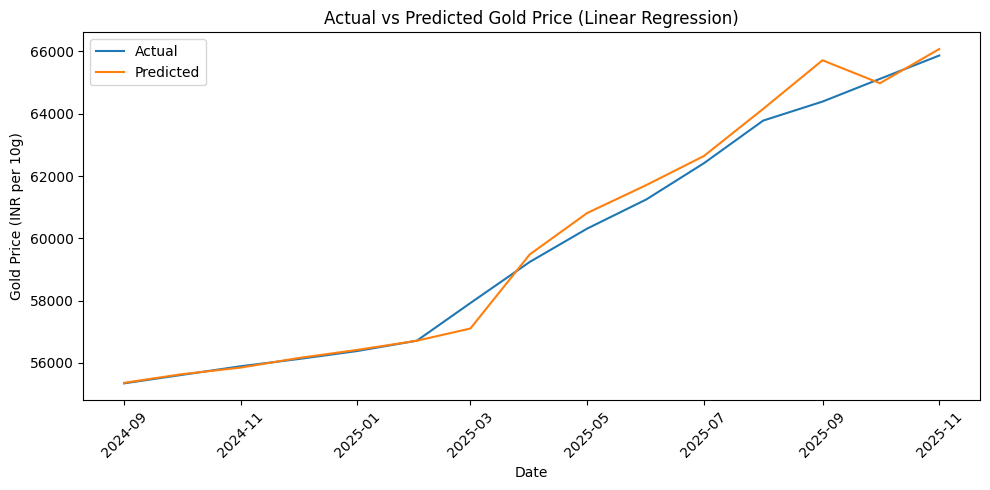

# Gold Price Analysis and Prediction

## 📌 Project Overview
This project focuses on analyzing historical gold price data in India and building a baseline machine learning model to understand and predict price trends.  
The dataset contains **monthly gold prices from 2019 to 2025**.

The objective of this project is to demonstrate a **complete end-to-end data science workflow**, including data cleaning, exploratory data analysis (EDA), feature engineering, model building, and evaluation.

---

## 🎯 Problem Statement
Gold prices fluctuate due to various economic and market factors.  
Understanding historical patterns helps in analyzing trends and validating predictive models.

This project aims to:
- Analyze historical gold price trends
- Engineer meaningful time-series features
- Evaluate how well a machine learning model predicts unseen historical data

---

## 📊 Dataset Description
The dataset contains monthly gold price data with the following columns:

- **Year** – Year of observation  
- **Month** – Month of observation  
- **Gold_Price_INR_per_10g** – Gold price in INR per 10 grams  

The data spans from **2019 to 2025** and is suitable for time-series analysis.

---

## 🧹 Data Cleaning
The following data cleaning steps were performed:
- Checked for missing values and data consistency
- Validated data types
- Created a **Date** column by combining Year and Month
- Sorted the data chronologically to maintain correct time order

---

## 🔍 Exploratory Data Analysis (EDA)
EDA was conducted to understand price behavior and trends:
- Visualized long-term gold price trends using line plots
- Analyzed year-wise and month-wise average prices
- Applied rolling averages to smooth short-term fluctuations
- Identified overall upward trends and periods of volatility

---

## 🛠 Feature Engineering
To improve model learning, the following features were engineered:
- **Lag features** (previous month gold price)
- **Rolling averages** (3-month and 6-month)
- **Monthly price change**
- **Monthly percentage change**

A target variable was created to predict the next month’s gold price.  
Rows with missing values introduced by lagging and rolling operations were removed.

---

## 🤖 Model Building
- **Linear Regression** was used as a baseline machine learning model
- A **time-based train–test split** was applied to avoid data leakage
- The model was trained on historical data and evaluated on unseen past data

---

## 📈 Model Evaluation
Model performance was evaluated using:
- **Mean Absolute Error (MAE)**
- **Root Mean Squared Error (RMSE)**

Predicted values were visually compared with actual historical prices to assess how well the model captured trends.  
This evaluation represents **historical backtesting**, not future forecasting.

---

## 🧠 Key Learnings
Through this project, I learned:
- How to structure an end-to-end data science project
- The importance of data cleaning and EDA before modeling
- Feature engineering techniques for time-series data
- Proper time-based validation to prevent data leakage
- How to interpret regression evaluation metrics
- The difference between model evaluation and future prediction

---

## ⚠️ Limitations
- Linear Regression assumes a linear relationship and may struggle with sudden price fluctuations
- External economic factors influencing gold prices were not included
- The model is used for evaluation purposes, not real-time forecasting

---

## 🚀 Future Improvements
- Use non-linear models such as Random Forest or Gradient Boosting
- Incorporate macroeconomic indicators
- Extend the project to perform actual future price forecasting
- Build a dashboard to present insights visually

---

## 🏁 Conclusion
This project demonstrates a complete and well-structured **data analysis and machine learning pipeline**.  
It is suitable for **Data Analyst and entry-level Machine Learning roles** and provides a strong foundation for future AI-focused enhancements.

---

## 📄 Project Report
A detailed project report is available in PDF format:

📘 **Gold_Price_Analysis_and_Prediction_Description.pdf**

---

## 🛠 Tools & Technologies Used
- Python
- Pandas
- NumPy
- Matplotlib
- Scikit-learn
- Jupyter Notebook

---

## 👤 Author
**Pravin Kamble**

---
## 📈 Model Evaluation

### Actual vs Predicted Gold Price

⭐ If you found this project useful, feel free to star the repository!
